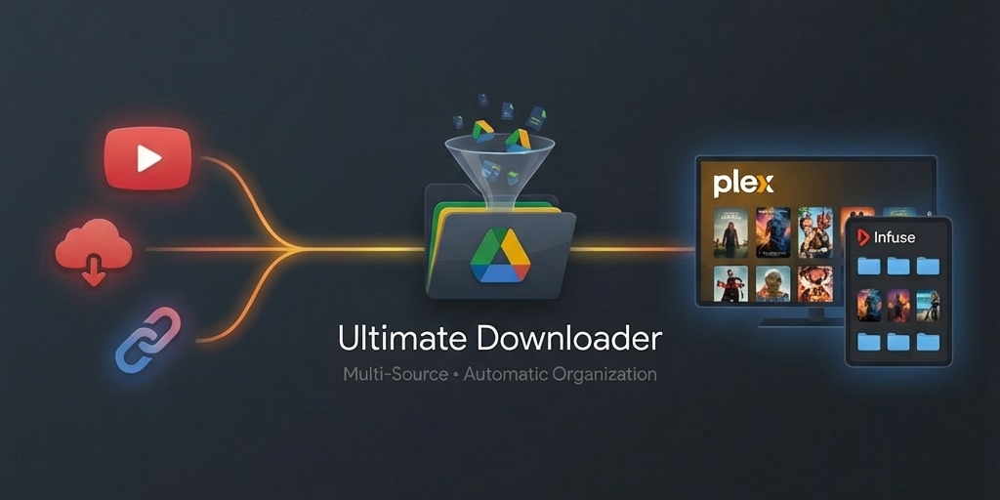

A powerful Google Colab-based tool for downloading media from multiple sources directly to Google Drive with automatic Plex-friendly organization.

## ✨ Features

- **Multi-Source Downloads**: Gofile, Pixeldrain, Mega.nz, FShare, YouTube, OK.ru, Twitch, Vimeo, and more
- **35+ Premium Hosts via Real-Debrid or TorBox**: MediaFire, 1fichier, Rapidgator, Nitroflare, etc.
- **Choice of Debrid Service**: Select Real-Debrid, TorBox, or None from the Debrid toggle — both handle premium hosts and magnet links
- **Parallel Downloads**: Download up to 5 files concurrently for Gofile, Pixeldrain, debrid, and direct HTTP links
- **Session Resume**: Automatically resume interrupted downloads after runtime restart
- **Interrupt & Retry**: Stop a running batch cleanly with Runtime → Interrupt (progress saved); retry failures with one click via the Retry Failed button
- **Queue Management**: Preview, reorder, sort (A-Z/Z-A), and select which files to download
- **Download History**: Persistent log of completed downloads for debugging
- **Debrid Integration**: Unrestrict premium links and process magnet links via Real-Debrid or TorBox
- **Magnet File Selection**: Preview individual torrent files and choose which to download
- **Smart Media Sorting**: Automatically organises into Plex-compatible folder structures
  - TV Shows: `Show Name/Season XX/Show Name - S01E01.mkv`
  - Movies: `Movie Name/Movie Name.mkv`
- **TMDB Metadata Matching**: Canonical names, years, and anime absolute-episode → season mapping via the free TMDB API (optional); correct or clear any auto-match per item in the queue, and corrections persist across resume
- **Archive Extraction**: Handles RAR, ZIP, 7Z with sequential extraction to save Colab disk space
- **Subtitle Preservation**: Keeps `.srt`, `.ass`, `.sub`, `.vtt` files regardless of size
- **Duplicate Prevention**: Skips already-downloaded files across sessions
- **Progress Tracking**: Real-time progress bar with speed display

---

## 🚀 Quick Start

### 1. Open in Google Colab

[Google Colab](https://colab.research.google.com/) is a free cloud-based Python environment that runs in your browser — no installation needed.

1. Go to [colab.research.google.com](https://colab.research.google.com/)
2. Click **New Notebook** (or File → New notebook)
3. Paste this one-liner into a cell:

```python
import requests; exec(requests.get("https://raw.githubusercontent.com/xersbtt/ultimate-downloader-colab/main/ultimate_downloader.py").text)
```

Run the cell and the UI will appear automatically.

> **Want to review the code first?** Open [`ultimate_downloader.py`](https://github.com/xersbtt/ultimate-downloader-colab/blob/main/ultimate_downloader.py), copy the entire contents, and paste directly into a Colab cell.

### 2. Configure API Keys (Optional)

**Option A: Manual Entry**  
Click ⚙️ Settings and enter your Gofile / Real-Debrid / TorBox tokens in the API Key fields, then pick your debrid service from the **Debrid** toggle.

**Option B: Colab Secrets (Recommended)**  
Store your keys securely in Colab Secrets:
1. Click the 🔑 key icon in Colab's left sidebar
2. Add secrets named `GOFILE_TOKEN`, `RD_TOKEN` (Real-Debrid), and/or `TB_TOKEN` (TorBox), and `TMDB_API_KEY` (TMDB metadata matching)
3. For FShare: Add `FSHARE_EMAIL` and `FSHARE_PASSWORD`
4. Keys will auto-populate on each run

> Colab Secrets is the recommended place for credentials — tokens and passwords are **not** written to Google Drive, so they are re-read from Secrets (or the Settings fields) each run.

### 3. Paste Your Links

Enter your download links in the text area (one per line):
```
https://gofile.io/d/abc123
https://pixeldrain.com/u/xyz789
magnet:?xt=urn:btih:...
https://www.youtube.com/playlist?list=...
```

### 4. Start Downloading

**Option A: Resolve Links** (Recommended for playlists or batches)
- Click **Resolve Links** to preview the queue
- Review detected files, adjust naming/organisation if needed
- Click **Start Download** to begin

**Option B: Quick Download** (Fastest for single videos)
- Click **Quick Download** to start immediately
- Skips the queue preview — downloads begin right away
- Enable subtitles via ⚙️ Settings → "Include subtitles in quick downloads"

Files are automatically organised and saved to your Google Drive.

---

## ⚙️ Configuration Options

### UI Fields

| Field | Description |
|-------|-------------|
| **Auto-organise** | Toggle automatic file renaming and organisation (uncheck to save with original filenames to Downloads) |
| **Name** | Override auto-detected name for folder/filename (works for both TV shows and movies) |
| **Year** | Append `(YYYY)` to folder name for movies and TV shows (file name unchanged) |
| **Movies/TV \| Anime** | Toggle between regular folders (Movies, TV Shows) and anime folders (Anime Movies, Anime Series) |
| **Category** | Force Movie or Series classification (Auto: detect from filename) |
| **Parallel DLs** | Number of concurrent downloads (1-5, applies to Gofile/Pixeldrain/RD/HTTP) |
| **Auto Retry** | Optional: when a batch ends with failures, automatically re-run 🔁 Retry Failed up to this many times (stops early once everything succeeds). Empty = off. A kernel interrupt cancels the chain |

### Drive Folders

**Default locations** (customizable via ⚙️ Settings):
- `My Drive/TV Shows/` - Files with detected episode patterns (S01E01, Ep 1, 第5集, etc.)
- `My Drive/Movies/` - Files without episode patterns
- `My Drive/YouTube/` - YouTube downloads without episode patterns
- `My Drive/Anime Series/` - TV shows when Anime mode is enabled
- `My Drive/Anime Movies/` - Movies when Anime mode is enabled
- `My Drive/Downloads/` - All files when Auto-organise is disabled (original filenames)
- `My Drive/Ultimate Downloader/` - Config files (session.json, history.json, settings.json)

> **API Keys**: Gofile, Real-Debrid, and TorBox tokens are configured in ⚙️ Settings (select the active debrid service with the **Debrid** toggle). For security, use Colab Secrets (see Quick Start) — credentials are never written to Drive.

> **Quick Download Subtitles**: Enable "Include subtitles in quick downloads" in ⚙️ Settings to automatically fetch subtitles when using the Quick Download button.

> **Overlap Drive moves** (⚙️ Settings → Performance): finished files move to Drive on a background thread while the next download starts immediately, instead of each worker pausing to move its own file. Opt-in — it queues up to 3 finished files on Colab's local disk and keeps more debrid connections busy, so leave it off if disk space or your provider's concurrent-download slots are tight.

**Customizing Download Directories:**
1. Click ⚙️ Settings in the main UI
2. Edit the path fields for TV Shows, Movies, or YouTube (paths relative to Drive root)
3. Or click 📁 to browse your Drive folders with the folder picker:
   - Navigate with ⬆️ Up and 📂 Open
   - Create new folders with ➕ Create
   - Select with ✓ Select
4. Settings auto-save and persist across sessions

---

## 📺 Supported Sources

| Source | Features | Download Mode |
|--------|----------|---------------|
| **Gofile** | Public/private folders, cookie auth | Parallel |
| **Pixeldrain** | Direct file downloads | Parallel |
| **Real-Debrid** | Link unrestricting, file selection from magnets, 35+ premium hosts | Parallel (cached) / Sequential (uncached) |
| **TorBox** | Web-download unrestricting, magnet file selection, torbox.app share links (Copy JDownloader Folder Links), 35+ premium hosts | Parallel (cached) / Sequential (uncached) |
| **FShare** ⚠️ | VIP file/folder downloads (experimental) | Sequential |
| **Direct HTTP** | Any direct download URL | Parallel |
| **Mega.nz** | Full download support | Sequential |
| **YouTube** | Videos, playlists, subtitles | Sequential |
| **OK.ru** | Videos from Odnoklassniki | Sequential |
| **Twitch** | VODs and clips | Sequential |
| **Vimeo** | Video downloads | Sequential |
| **Archive.org** | Videos, audio, documents (no DRM) | Sequential |
| **TikTok** | Video downloads | Sequential |
| **Dailymotion** | Video downloads | Sequential |
| **SoundCloud** | Audio downloads | Sequential |

---

## 📜 Changelog

| Version | Highlights |
|---------|------------|
| v5.3 | NNxNN episode detection, anti-idle keep-alive |
| v5.4 | Fixed Colab anti-idle, RD magnet rate limiting |
| v5.5 | FShare VIP support, OK.ru video support |
| v6.0 | TorBox debrid integration, security & reliability overhaul |
| v6.1 | Per-download progress bars, UI alignment polish |
| v6.2 | TMDB metadata matching, anime season mapping, stop & retry controls |
| v6.3 | TorBox share-link support, parallel cached-torrent downloads, auto retry, EP-range pack fix |

## 🎬 Episode Detection Patterns

The downloader recognises these naming patterns:

| Pattern | Example | Result |
|---------|---------|--------|
| Standard | `Show.Name.S01E05.mkv` | Season 01, Episode 05 |
| Asian Drama | `Drama EP01.mkv` | Season 01, Episode 01 |
| Chinese | `电视剧 第5集.mkv` | Season 01, Episode 05 |
| Japanese | `アニメ 第10話.mkv` | Season 01, Episode 10 |
| Vietnamese | `Phim Tập 3.mkv` | Season 01, Episode 03 |
| Korean | `드라마 5화.mkv` | Season 01, Episode 05 |
| German | `Serie Folge 2.mkv` | Season 01, Episode 02 |
| Spanish | `Serie Capitulo 4.mkv` | Season 01, Episode 04 |
| Portuguese | `Serie Episodio 8.mkv` | Season 01, Episode 08 |
| Fansub Bracket | `[Group] Show - 01 [1080p].mkv` | Season 01, Episode 01 |
| Underscore-Dash | `Show_Name_-_03_(480p).mkv` | Season 01, Episode 03 |
| High Episode | `One Piece - 1042 [1080p].mkv` | Season 01, Episode 1042 |
| Pipe/Dash | `Show Name \| 7.mkv` | Season 01, Episode 07 |
| Asian Multi-Part | `Movie 上篇.mkv` | Adds `-pt1` suffix |

> **Tip**: When using "Show Name" override with playlists, the playlist position (1, 2, 3...) will be used as the episode number if no pattern matches.

### Limitations & Workarounds

The auto-organise feature works well for ~95% of standard naming conventions, but some edge cases require manual overrides:

| Edge Case | Issue | Workaround |
|-----------|-------|------------|
| Numbers in movie title | `21 Jump Street` detected as Episode 21 | Set **Category** to "Movie" |
| "Part X" in movie title | `Movie Part 2` may detect as Episode 2 | Set **Category** to "Movie" |
| No episode pattern | `Random_Video_Name.mkv` detected as Movie | Set **Category** to "Series" + use **Name** field |
| Unusual separator | `Show.Name.01.Title.mkv` (no dash) | Use **Name** field to set show name |
| Decimal episodes | `Show - 01.5 [OVA].mkv` | Detected as Episode 1 (decimal ignored) |
| Season in title | `Show Season 2 - 01.mkv` | Season not extracted; files go to Season 01 |

**Best Practices:**
- For consistent batch naming (e.g., fansub releases), auto-detect is very accurate
- For mixed or unusual filenames, use **Name** + **Category** overrides before downloading
- For movies with sequel numbers (`Toy Story 3`), auto-detect works if year is present (`2010`)
- If unsure about a filename, set the **Name** and **Category** fields to guarantee correct organization

---

## 🍪 YouTube Cookies (Experimental)

> ⚠️ **Warning**: Cookie authentication is experimental and may cause issues.

For Premium quality or members-only content:

1. Export `cookies.txt` from your browser (using a cookies.txt extension)
2. Click ⚙️ Settings → **📤 Upload Cookies**
3. Select your cookies file

**Known Issues:**
- Cookies may trigger "Requested format is not available" errors
- Session expiry or IP mismatch can cause authentication failures
- **Fix**: Click **🗑️ Clear Cookies** in Settings to remove problematic cookies

---

## 🔗 FShare Support (Experimental)

> ⚠️ **Warning**: FShare support is experimental and relies on web scraping. It may break without notice if FShare changes their website.

Download files from [fshare.vn](https://www.fshare.vn) using your VIP account. Supports both single file links and folder links.

### Setup

1. You need a **VIP FShare account** (free accounts cannot generate download links)
2. Enter your FShare email and password in ⚙️ Settings, or add `FSHARE_EMAIL` and `FSHARE_PASSWORD` to Colab Secrets

### How It Works

**Single file** (`fshare.vn/file/...`): Resolves the download link immediately during Resolve Links phase.

**Folder** (`fshare.vn/folder/...`):
1. **Resolve Links** → Lists all files in the folder (free, no download cost)
2. **Review queue** → Remove unwanted files to save your daily download limit
3. **Start Download** → Resolves download links only for remaining files, then downloads

> 💡 **Tip**: For folders, download links are NOT resolved until you click Start Download. This means you can review the queue and remove files you don't want — only files you keep will count toward your daily download limit.

### Known Issues & Workarounds

| Issue | Cause | Workaround |
|-------|-------|------------|
| Login fails on first 1-2 attempts | FShare session warm-up | Click Resolve Links again — it usually works on the 2nd or 3rd attempt |
| `policydownload` error | FShare server-side restriction (transient) | Wait a few minutes and try again; not related to your download quota |
| Folder shows fewer files than expected | FShare paginates at 50 items | Handled automatically — the downloader fetches all pages |
| `Max retries exceeded` errors | Too many rapid requests to FShare | The downloader auto-stops after 3 consecutive failures; wait and retry |
| Download link resolution fails | Session expired or CSRF token stale | Clear the session by restarting the Colab runtime and trying again |
| All files fail to resolve | VIP account may have expired | Check your FShare account status at fshare.vn |

### Limitations

- Each resolved download link counts toward your **daily FShare download limit**, even if you don't proceed with the actual download (single file links only — folder listing is free)
- FShare's web scraping approach is inherently fragile and may require updates when FShare changes their website
- Download speeds depend on your FShare VIP tier and the Colab server's network conditions
- The FShare API is officially suspended; this feature uses web-based session scraping as a workaround

---

## 🔤 Subtitle Languages

When YouTube videos are detected in the Queue Preview, you can select which subtitle languages to download:
- Default: English + Vietnamese
- Available: 12 languages (en, vi, zh, ja, ko, th, id, es, fr, de, pt, ru)
- Works for both video downloads and subtitles-only mode

**Playlist Range:** Also appears in Queue Preview when a YouTube playlist is detected. Use `1,3,5-10` syntax to select specific videos.

---

## 📋 Buttons

| Button | Action |
|--------|--------|
| **Resolve Links** | Parse links and show Queue Preview for review |
| **Quick Download** | Download immediately without queue preview (respects auto-organise settings) |
| **Start Download** | (In Queue) Download videos and organise to Drive |
| **Download Subtitles** | (In Queue) Fetch subtitles from YouTube/streaming sources only. Non-streaming links (Gofile, Mega, etc.) in mixed batches will still download normally. |
| **Resume Previous Session** | Resume interrupted session (appears when session exists) |
| **🔄 Restart Runtime** | Restart Colab runtime (appears after failures for easy resume) |
| **📜 (History)** | View last 10 downloads from history log |
| **⚙️ (Settings)** | Configure download directories, manage cookies, Quick Download subtitle options, clear data files |

---

## 🔧 Troubleshooting

| Issue | Solution |
|-------|----------|
| "Gofile Error: error-notFound" | Link expired or requires authentication |
| "RD Timeout" | Torrent not cached, try a different magnet |
| "Mega Error" | Link invalid or requires login |
| Files not detected as TV | Use "Show Name" override field |
| YouTube videos skipping | Clear YT archive via ⚙️ Settings |
| **"Requested format is not available"** | **yt-dlp auto-updates on each run. If persists, clear cookies via ⚙️ Settings** |
| FShare login fails | Try clicking Resolve Links again (2-3 attempts); restart runtime if persistent |
| FShare `policydownload` error | Transient FShare server issue — wait a few minutes and retry |
| FShare `Max retries exceeded` | Too many rapid requests — downloader auto-stops after 3 failures; retry later |

---

## ❓ FAQ

**Why use this instead of local download tools?**

Colab provides free cloud compute with high-speed bandwidth, so downloads go directly to Google Drive without using your local internet or storage. Great for large files, slow connections, or when you want files ready on Drive for streaming to other devices.

**I already have Real-Debrid — why not just use Stremio?**

Stremio is for streaming; this is for downloading. Use this when you want to:
- Build a permanent media library on Drive
- Download for offline access or archival
- Grab YouTube playlists, Mega links, or other sources Stremio doesn't support
- Organise downloads into Plex-friendly folder structures automatically

**Isn't this just a wrapper for yt-dlp/aria2?**

Yes and no. It orchestrates multiple tools (yt-dlp, aria2, megatools, unrar) under one UI, but adds significant value:
- Unified interface for 35+ sources including premium hosts via Real-Debrid or TorBox
- Automatic Plex-compatible organization (Show/Season/Episode structure)
- Parallel downloads with session resume across Colab restarts
- Queue management with preview, reordering, and selective downloads
- Persistent history and duplicate prevention across sessions

**Is it safe to run code from a URL?**

The code is fully open-source — you can [review it on GitHub](https://github.com/xersbtt/ultimate-downloader-colab/blob/main/ultimate_downloader.py) or paste it directly into Colab instead of using the one-liner. Nothing is hidden.

**Why did my downloads stop after a few hours?**

Colab has a ~12 hour runtime limit (less if idle). If interrupted, just run the script again and click **Resume Previous Session** — your progress is saved to Drive.

**Is there a storage limit?**

Colab's temp disk is ~100GB, but downloads transfer directly to Google Drive, so you're only limited by your Drive quota (15GB free, more with Google One).

**Do I need a Google account?**

Yes — Google Colab and Google Drive both require a Google account.

**Is a debrid service (Real-Debrid / TorBox) required?**

No. Many sources work without one: YouTube, Mega.nz, Gofile, Pixeldrain, Vimeo, Twitch, and direct HTTP links. A debrid service (Real-Debrid **or** TorBox) unlocks 35+ premium file hosts and magnet links — pick whichever you have with the **Debrid** toggle.

**How do I get API tokens?**

- **Gofile**: Log in at [gofile.io](https://gofile.io), go to My Profile → Account Token
- **Real-Debrid**: Log in at [real-debrid.com](https://real-debrid.com), go to My Devices
- **TorBox**: Log in at [torbox.app](https://torbox.app), go to Settings → API
- **TMDB**: Free — create an account at [themoviedb.org](https://www.themoviedb.org/settings/api) and request an API key

This product uses the TMDB API but is not endorsed or certified by TMDB.

**Can I run this locally instead of Colab?**

Not directly — the UI uses Colab-specific widgets (ipywidgets for Colab). However, the underlying tools (yt-dlp, aria2) work locally if you want to adapt it.

**Can I use this on mobile?**

Yes! Colab works in mobile browsers. The UI is functional on phones/tablets, though a larger screen is more comfortable.

---

## 📁 File Structure

```
Ultimate Downloader/
├── ultimate_downloader.py          # Latest version (always current)
├── Ultimate_Downloader.ipynb       # Jupyter notebook launcher
├── Ultimate Downloader.url         # Windows shortcut to Colab
├── CHANGELOG.md                    # Version history
├── README.md                       # This file
├── LICENSE                         # MIT Licence
├── banner_2x1.png                  # GitHub banner image
├── .gitignore                      # Git ignore rules
└── archive/                        # Previous versions (v5.5 and earlier)
```

---

## 📜 License

This project is licensed under the [MIT License](LICENSE).

- ✅ Free to use, modify, and distribute
- ✅ Commercial use allowed
- ✅ Just include the copyright notice

---

## 🙏 Credits

Built with:
- [yt-dlp](https://github.com/yt-dlp/yt-dlp) - Video downloading
- [aria2](https://aria2.github.io/) - Multi-connection downloads
- [megatools](https://megatools.megous.com/) - Mega.nz support
